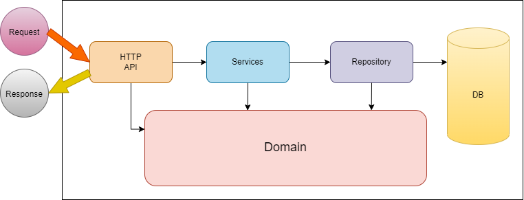

# Report

## Table of Contents

1. [Introduction](#introduction)
2. [Modeling the database](#modeling-the-database)
3. [Software organization](#software-organization)
4. [Open-API Specification](#open-api-specification)
5. [Request Details](#request-details)
6. [Connection Management](#connection-management)
7. [Data Access](#data-access)
8. [Error Handling/Processing](#error-handlingprocessing)
9. [Critical Evaluation](#critical-evaluation)

## Introduction

This document contains the relevant design and implementation aspects of the LS project's first phase. The project is a
multiplayer video game sessions management system developed in Kotlin, using the HTTP4K library for handling HTTP
requests and kotlinx.serialization library for body serialization/deserialization.

## Modeling the database

### Conceptual model ###

The following diagram holds the Entity-Relationship model for the information managed by the system.


We highlight the following aspects:

* The system manages three main entities: Player, Game, and Session.
    * Each Player has a unique number, a name, and a unique email.
    * Each Game is characterized by a unique number, a unique name, the developer, and a set of genres.
    * Each Session is characterized by a unique number, the number of players, the session date, the game, and the
      associated players.

The conceptual model has the following restrictions:

* Each Player's email must be unique.
    * Each Game's name must be unique.

### Physical Model ###

The physical model of the database is available in:

- create tables: [createTables.sql](../src/main/sql/createSchema.sql)
    - insert data: [insertData.sql](../src/main/sql/addData.sql)

We highlight the following aspects of this model:

* The database schema closely follows the conceptual model, with tables for Player, Game, and Session.
    * A Session_Player was created to represent the many-to-many relationship between Session and Player.

## Software organization

### Open-API Specification

In our [Open-API specification](backend/http-api.yaml), we highlight the following aspects:

* The API provides endpoints for managing players, games, and sessions.
    * All GET operations that return a sequence support paging.

**API endpoints** are organized as follows:

| Endpoints                       | HTTP Methods                                     |
|---------------------------------|--------------------------------------------------|
| /api/player                     | [POST](#post-apiplayer)                          |
| /api/player/{pid}               | [GET](#get-apiplayerpid)                         |
| /api/game                       | [GET](#get-apigame), [POST](#post-apigame)       |
| /api/game/{gid}                 | [GET](#get-apigamegid)                           |
| /api/session                    | [GET](#get-apisession), [POST](#post-apisession) |
| /api/session/{sid}              | [GET](#get-apisessionsid)                        |
| /api/session/{sid}/player/{pid} | [PUT](#put-apisessionsidplayerpid)               | 

### GET api/player/{pid}

**Description:** Retrieves the specified player

**Request:**

- **URI Params:**
    - pid (Integer) Player ID

**Example:**

```shell
curl --location --request GET 'http://localhost:8080/api/player/1' --header 'Authorization: Bearer {Access Token}'
```

**Success Response:**

- **Status Code:** 200 OK
    - **Content:** An object with the information of the player
    - **Content Type:** application/json

    - **Schema:**

````
{
  "pid": Integer,
  "name": String,
  "email": String
}
````

**Error Responses:**

- 404 Not Found
    - 401 Unauthorized

### POST /api/player

**Description:** Create a new player

**Request:**

- **Content:** An object with the information of the player
    - **Content Type:** application/json
    - **Schema:**

````
{
  "name": String,
  "email": String
}
````

**Example:**

```shell
curl --location --request POST 'http://localhost:8080/api/player' --header 'Content-Type: application/json' --header 'Authorization: Bearer {Access Token} ' --data-raw '{ "name": "Player1", "email": "player1@gmail.com" }'
```

**Success Response:**

- **Status Code:** 201 Created
    - **Content:** An object with the information of the created player
    - **Content Type:** application/json
    - **Schema:**
      {
      "pid": Integer,
      "name": String,
      "email": String
      }

**Error Responses:**

- 400 Bad Request
    - 409 Conflict

### GET /api/game

**Description:** Retrieves a list of games

**Request:**

* **Query String:**
    * skip (_Integer_, _Optional_) - Number of elements to skip
    * limit (_Integer_, _Optional_) - Maximum number of elements to return

**Example:**

```shell
curl --location --request GET 'http://localhost:8080/api/game' --header 'Authorization: Bearer {Access Token}'
```

**Success Response:**

- **Status Code:** 200 OK
    - **Content:** An array of objects, each with the information of a game
    - **Content Type:** application/json
    - **Schema:**

````
[
  {
    "gid": Integer,
    "name": String,
    "developer": String,
    "genres": [
      String
    ]
  }
]
````

**Error Responses:**

- 404 Not Found

### GET /api/game/{gid}

**Description:** Retrieves the specified game

**Request:**

- **URI Params:**
    - gid (Integer) Game ID

**Example:**

```shell
curl --location --request GET 'http://localhost:8080/api/game/1' --header 'Authorization: Bearer {Access Token}'
```

**Success Response:**

- **Status Code:** 200 OK
    - **Content:** An object with the information of the game
    - **Content Type:** application/json
    - **Schema:**

````
{
  "gid": Integer,
  "name": String,
  "developer": String,
  "genres": [
    String
  ]
}
````

**Error Responses:**

- 404 Not Found
    - 401 Unauthorized

### POST /api/game

**Description:** Create a new game.

**Request:**

- **URI Params:**
    - gid (Integer) Game ID

    - **Content:** An object with the information of the game
    - **Content Type:** application/json
    - **Schema:**

````
{
  "name": String,
  "developer": String,
  "genres": [
    String
  ]
}
````

**Example:**

```shell
curl --location --request POST 'http://localhost:8080/api/game/1' --header 'Content-Type: application/json' --header 'Authorization: Bearer {Access Token} ' --data-raw '{ "name": "Game1", "developer": "Developer1", "genres": ["Genre1", "Genre2"] }'
```

**Success Response:**

- **Status Code:** 201 Created

**Error Responses:**

- 409 Conflict
    - 401 Unauthorized
    - 404 Not Found

### GET /api/session

**Description:** Retrieves a list of sessions

**Request:**

* **Query String:**
    * skip (_Integer_, _Optional_) - Number of elements to skip
    * limit (_Integer_, _Optional_) - Maximum number of elements to return

**Example:**

```shell
curl --location --request GET 'http://localhost:8080/api/session' --header 'Authorization: Bearer {Access Token
```

**Success Response:**

- **Status Code:** 200 OK
    - **Content:** An array of objects, each with the information of a session
    - **Content Type:** application/json
    - **Schema:**

````
[
  {
    "sid": Integer,
    "numPlayers": Integer,
    "sessionDate": String,
    "game": Integer,
    "players": [
      Integer
    ]
  },
  ...
]
````

**Error Responses:**

- 400 Bad Request
    - 404 Not Found

### POST /api/session

**Description:** Create a new session.

**Request:**

- **URI Params:**
    - sid (Integer) Session ID

**Content:** An object with the information of the session

- **Content Type:** application/json
    - **Schema:**

````
  {
  "numPlayers": Integer,
  "sessionDate": String,
  "game": Integer,
  "players": [Integer]
  }
````

**Example:**

```shell
curl --location --request POST 'http://localhost:8080/api/session/1' --header 'Content-Type: application/json' --header 'Authorization: Bearer {Access Token} ' --data-raw '{ "numPlayers": 4, "sessionDate": "2022-01-01T00:00:00Z", "game": 1, "players": [1, 2, 3, 4] }'
```

**Success Response:**

- **Status Code:** 201 Created

**Error Responses:**

- 400 Bad Request
    - 401 Unauthorized
    - 404 Not Found

### GET /api/session/{sid}

**Description:** Retrieves the specified session

**Request:**

- **URI Params:**
    - sid (Integer) Session ID

**Example:**

```shell
curl --location --request GET 'http://localhost:8080/api/session/1' --header 'Authorization: Bearer {Access Token}'
```

**Success Response:**

- **Status Code:** 200 OK
  **Content:** An object with the information of the session
    - **Content Type:** application/json
    - **Schema:**

````
  {
  "sid": Integer,
  "numPlayers": Integer,
  "sessionDate": String,
  "game": Integer,
  "players": [
    Integer
  ]
}
````

**Error Responses:**

- 404 Not Found

### DELETE /api/session/{sid}

**Description:** Deletes the specified session

**Request:**

- **URI Params:**
    - sid (Integer) Session ID

**Example:**

```shell 
curl --location --request DELETE 'http://localhost:8080/api/session/1' --header 'Authorization : Bearer {Access Token}'
```

**Success Response:**

- **Status Code:** 204 No Content.
  **Content:** An object with the information of the session
    - **Content Type:** application/json
    - **Schema:**

````
{
  "message": "Session deleted.
}
````

- **Error Responses:**
    - 404 Not Found
    - 401 Unauthorized

### PUT /api/session/{sid}/player/{pid}

**Description:** Adds a player to the specified session. The player is added only if the session already exists.

**Request:**

- **URI Params:**
    - sid (Integer) Session ID
    - pid (Integer) Player ID

**Example:**

```shell
curl --location --request PUT 'http://localhost:8080/api/session/1/player/1' --header 'Authorization: Bearer {Access Token}'
```

**Success Response:**

- **Status Code:** 204 No Content

**Error Responses:**

- 409 Conflict
    - 401 Unauthorized
    - 404 Not Found

### Request Details

Requests are handled by the HTTP4K library. The request parameters are validated in the corresponding handler functions
before being used.
The following diagram shows the structure of the API:



### Connection Management

A connection pool manages connections to the Postgres database. Each request is handled within a single
transaction scope.

### Data Access

Data access is handled by DAO classes for each of the main entities. These classes provide methods for creating,
retrieving, updating, and deleting entities in the database.

There are two data access implementations that implement the interface **AppDB**:

- **AppMemoryDB:** stores the data in memory
    - **AppJdbcDB:** stores the data in a Postgres database

The fact that the data is stored in memory allows for testing without the need for a database.
The use of an interface allows for easy switching between the two implementations, being the Service Layer independent
of the data access layer.

### Error Handling/Processing

A centralized error handling function is responsible for managing exceptions and returning corresponding HTTP responses.
The execStart function is specifically used to intercept and manage exceptions across all router functions. When
errors occur at the service layer, they are conveyed to the router as a Failure, which is a variant of the Either type.
All errors adhere to the Problem Details for HTTP APIs as outlined
in [RFC 7807](https://datatracker.ietf.org/doc/html/rfc7807), ensuring a standardized approach to error reporting.

## Critical Evaluation

All the functionalities for phase 1 have been implemented. However, there are some areas for improvement:

* The validation of request parameters could be made more robust.